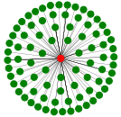
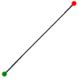
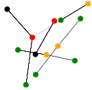
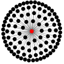

# GraphEmbeding
<i> Illustration of graph embedding techniques as applied to a specific data set </i>

Graphs are playing an ever important role in various areas of data science. The building blocks of graphs are nodes and edges (or links). There exists a number of different formats to store graph data. They all fall in the category of semi-structured data. 

Graphs can be used for visualization of complex data, for logical reasoning, for machine learning (ML) and deep learning (DL). In order to be used for machine and deep learning the graph data have to be converted to the format the ML and DL algorithms 'understand'. This format consists of rows and columns of numbers, commonly known as numerical matrices. The conversion from the node-edge to a matrix representation is not trivial and not unique. I.e. there are multiple ways to convert the way graph to a numerical matrix. The benefits and downsides of each method depend on the application area. 

The number of different ways to encode, or embed, graphs is constantly growning. It is not a goal of this repository  to present a complete, or even imcomplete list of graph embeddings developed up-to-date. Rather, the goal is to illustrate application of several graph embedding algorithms to one graph dataset. 

## Graph Dataset
We use the  [StreamSpot](https://github.com/sbustreamspot/sbustreamspot-data) data set The StreamSpot dataset is composed of 600 provenance graphs derived from 5 benign and 1 attack scenarios. 

Once the data is obtained, the next step in the data science process  is to the exploratory analysis, aka descriptive analytics. The [StreamSpot Explore Data.ipynb notebook](https://github.com/CyberActive/GraphEmbeding/blob/main/StreamSpot%20Explore%20Data.ipynb) provides detailed analysis of the dataset, including graph visualization.

The size of each graph is in tens and hundreds of thousands of edges; it is too big to visualize. Moreover, each graph is  a time progression, the processes captured there didn't happen at the same time. Therefore it is only reasonable to split each graph in a set of subgraphs for the purpose of visualization and for any further analytics, including clustering. We can see the activities in each of the 600 graphs can be split roughlty into several distinct types:  
 

   a process/thread performing single I/O operations with a large number of files 
   

  a process/thread is performing multiple I/O operations with a small number of files, stin, and stdout
   

  several processes and threads  performing I/O operations with several potentially overlapping files, stin, and stdout
   

  a process/thread performing single I/O operations witha large number of NA objects
   

Not all subgraphs fall cleanly into one the above categories, but we feel that they can used as a basis for assessing the quality of clustering. 

## Graph Embedding

As we mentioned above, in order to apply ML graph have to converted to a format amenable to ML algorithms. Graph embedding is one such approach. Some practical applications of graph embedding are
- Link prediction
- Anomaly detection
- Graph clustering

There are a number of different graph embedding algorithms, here is a representative sample:
- [node2vec](https://github.com/aditya-grover/node2vec)
- [Deep Walk](https://github.com/phanein/deepwalk)
- [LINE](https://github.com/tangjianpku/LINE)

In this post we compare node2vec embedding with CyberActive open-sourced embedding. Our embedding is designed for dynamic graphs, such as StreamSpot. It applies batch processing by splitting a large and potentially 'infinite' streaming graph data into small subgraphs with the edges, which represent timestamped events, being in a close time proximity. Using this approach we account for both the structural and temporal proximity of different nodes in the graph.

What is presented here in no way represent a rigorous analysis and comparison of two graph embedding technique. But it is a usefull and practial introduction to such an analysis. Another benefit of this analysis is visualization of subgraphs in the StreamSpot dataset, which to the best of our knowledge has not been done anywhere else. 
